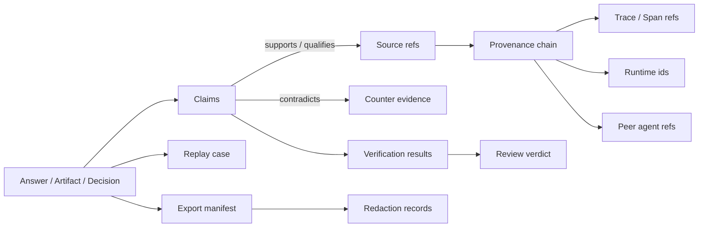

# Evidence model

Agent Evidence is a graph, not a flat report. A pack contains claims, sources, activities, agents, artifacts, verification checks, review verdicts, redaction records, export records, and replay boundaries.

## Graph shape

## Relationship types

| Edge | Meaning |
| --- | --- |
| `supports` | Source or fact directly supports a claim. |
| `partially_supports` | Source supports only part of a claim or needs qualification. |
| `contradicts` | Source conflicts with the claim. |
| `qualifies` | Source limits or conditions the claim. |
| `background` | Source is useful context but not direct support. |
| `generated_by` | Entity was produced by an activity. |
| `used` | Activity used a source, artifact, prompt, model, tool, policy, or human decision. |
| `derived_from` | Entity was transformed from another entity. |
| `attributed_to` | Entity is attributed to an agent, user, system, organization, or peer. |
| `reviewed_by` | Claim, artifact, or pack was reviewed. |
| `redacted_from` | Exported item was transformed from a sensitive original. |

## Evidence vs citations

Citations are a presentation surface. Evidence records are the structured facts behind that surface. A citation can point to one source. A claim map can explain source selection, contradiction, confidence, omission, verification, review state, and whether the quoted material was redacted or expired.

## Evidence vs telemetry

Telemetry explains operational behavior: spans, events, logs, metrics, latency, errors, and resource usage. Evidence explains trust: what was asserted, why it is supported, what contradicted it, who reviewed it, and what can be replayed. Agent Evidence links to telemetry ids instead of copying traces into the evidence graph.
