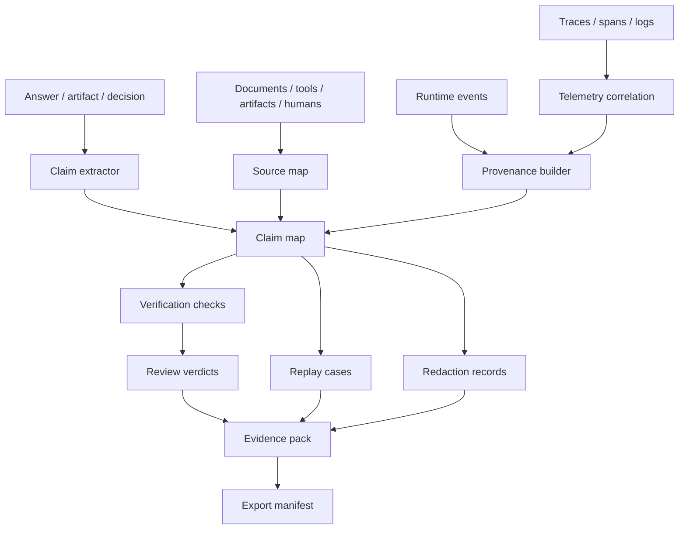

# Specification

Agent Evidence latest draft is a portable standard for evidence records around agent work. The core contract is the boundary between produced agent outcomes and the evidence needed to trust, replay, review, redact, and audit those outcomes.

Agent Evidence owns evidence relationships and read models. It does not own runtime execution, telemetry storage, source documents, artifact bytes, policy verdicts, legal conclusions, or UI rendering.

## Scope

Agent Evidence standardizes these implementation concerns:

1. Evidence pack identity, scope, lifecycle, and completeness status.
2. Claim maps that connect assertions to sources, artifacts, tool results, telemetry refs, and verification facts.
3. Source maps with selectors, snippets, retrieval metadata, omissions, freshness, trust, and contradiction records.
4. Provenance chains linking entities, activities, agents, models, tools, humans, artifacts, peer tasks, and runs.
5. Verification results, review verdicts, rubrics, sign-off facts, and open issues.
6. Replay cases that describe what can be reconstructed and which facts are missing.
7. Redaction, retention, privacy, access, and export-safety metadata.
8. Telemetry correlation to runtime ids, trace ids, span ids, events, logs, and metrics.
9. Export manifests for audit, support, compliance, incident response, and cross-system handoff.

Agent Evidence does **not** standardize a UI component model, model provider protocol, observability backend, artifact byte format, legal policy, vector store, tool registry, or workflow language.

## Pressure from real evidence systems

Agent Evidence is not a prettier citation format. Real agent systems repeatedly show these requirements:

1. Final answers mix facts, recommendations, and generated fields; each needs a separate support state.
2. Sources can support one claim, contradict another, and be background context for a third.
3. Retrieval systems omit, deduplicate, filter, or reject sources; reviewers need to know why.
4. Tool results and artifacts influence claims long after raw output was truncated or redacted.
5. Runtime traces are necessary for debugging but insufficient for review because they do not classify claim support.
6. Review and verification must be independently recorded; a passing check is not an approval.
7. Replay is often approximate because model output, APIs, indexes, policies, and permissions change.
8. Privacy redaction must preserve audit shape instead of silently deleting inconvenient facts.
9. Evidence must survive UI changes, backend migrations, support exports, and peer-agent handoff.

## Reference architecture

A compatible implementation may embed these steps in one process or split them across services. The contract is the portable evidence model, not deployment topology.

## Core objects

| Object | Purpose |
| --- | --- |
| `evidence_pack` | Portable container for the evidence graph of one session, task, run, artifact, answer, or review scope. |
| `claim` | Assertion, decision, recommendation, generated field, or artifact section that may require support. |
| `source_ref` | Pointer to a document, knowledge item, retrieval result, tool output, artifact, trace, human input, policy, peer record, or external record. |
| `support_edge` | Relationship between a claim and supporting, contradicting, qualifying, or background evidence. |
| `provenance_node` | Entity, activity, or agent-like participant in production of the outcome. |
| `verification_result` | Check result with status, coverage, severity, and evidence links. |
| `review_verdict` | Human, automated, or policy review decision. |
| `replay_case` | Instructions and boundaries for reconstructing the run or outcome. |
| `redaction_record` | What was hidden, transformed, tokenized, or withheld and why. |
| `export_manifest` | Portable manifest describing files, schemas, hashes, access, and completeness. |

## Identity model

| Identity | Meaning |
| --- | --- |
| `evidence_pack_id` | Stable id for the evidence pack. |
| `scope_id` | Session, thread, turn, task, run, artifact, answer, dataset row, review, incident, or external case id. |
| `claim_id` | Stable id for a claim or generated assertion. |
| `source_id` | Stable id for a source reference. |
| `edge_id` | Stable id for a support, contradiction, provenance, or review edge. |
| `verification_id` | Stable id for a verification result. |
| `review_id` | Stable id for a review verdict. |
| `replay_id` | Stable id for a replay case. |
| `redaction_id` | Stable id for a redaction record. |
| `export_id` | Stable id for an export manifest. |
| `trace_id` / `span_id` | Telemetry correlation ids when available. |

A compatible implementation MUST NOT rely on a single message id to represent all evidence. Claims, sources, artifacts, tool calls, reviews, replay cases, and exports need independently stable ids.

## Evidence pack envelope

Every evidence pack SHOULD include:

| Field | Requirement |
| --- | --- |
| `evidence_pack_id` | Required stable pack id. |
| `schema_version` | Required Agent Evidence schema version. |
| `scope` | Required scope object with at least one owner or external id. |
| `status` | Required lifecycle status. |
| `created_at`, `updated_at` | Required timestamps. |
| `producer` | Required runtime, service, worker, or host that assembled the pack. |
| `claims`, `sources`, `support_edges` | Inline compact facts or refs to claim/source maps. |
| `provenance` | Production graph or ref. |
| `verification_results`, `reviews` | Check and verdict facts. |
| `replay_cases` | Reconstruction instructions when available. |
| `redactions` | Redaction summary and records. |
| `telemetry` | Runtime and observability correlation refs. |
| `completeness` | Category-level completeness state. |
| `refs` | External payload refs, schemas, artifacts, traces, or export locations. |

Large payloads SHOULD be referenced, not copied. Inline data is appropriate for compact facts needed for offline inspection.

## Lifecycle

Evidence packs SHOULD support these states:

| Status | Meaning |
| --- | --- |
| `draft` | Evidence graph is being assembled. |
| `collecting` | Runtime, telemetry, source, artifact, or review facts are still arriving. |
| `ready` | Pack is complete enough for normal inspection. |
| `partial` | Pack is usable but known facts are missing. |
| `verified` | Required checks passed or were explicitly marked not applicable. |
| `reviewed` | Human, automated, or policy review produced a verdict. |
| `exported` | Export manifest was produced. |
| `redacted` | Sensitive content was transformed or withheld. |
| `expired` | Retention policy removed required refs or payloads. |
| `invalid` | Pack is malformed or contradicts authoritative facts. |

## Event envelope

Evidence events MAY be transported through CloudEvents-like envelopes, runtime event streams, logs, queues, or domain APIs. Every exported event SHOULD include:

| Field | Requirement |
| --- | --- |
| `type` | Required event class. |
| `event_id` | Required unique event id. |
| `timestamp` | Required producer timestamp. |
| `schema_version` | Agent Evidence event schema version. |
| `evidence_pack_id` | Present when the event belongs to a pack. |
| `claim_id`, `source_id`, `verification_id`, `review_id`, `replay_id`, `export_id` | Present when applicable. |
| `trace_id`, `span_id` | Present when telemetry is available. |
| `subject` | Optional scoped subject such as answer, task, artifact, or review. |
| `payload` | Typed event payload or ref. |

## Event classes

Compatible implementations SHOULD emit or export these event classes:

- `evidence.pack.created`
- `evidence.pack.updated`
- `evidence.claim.added`
- `evidence.source.linked`
- `evidence.support.updated`
- `evidence.provenance.linked`
- `evidence.verification.completed`
- `evidence.review.completed`
- `evidence.replay.created`
- `evidence.redaction.applied`
- `evidence.export.created`
- `evidence.warning`
- `evidence.error`

## Completeness model

A pack SHOULD declare completeness by category, not only as one boolean:

| Category | Examples |
| --- | --- |
| `runtime` | session, thread, turn, task, run, tool ids. |
| `telemetry` | trace ids, spans, logs, metrics. |
| `sources` | selected, omitted, missing, stale, contradicted sources. |
| `claims` | supported, unsupported, contradicted, unreviewed claims. |
| `artifacts` | artifact refs, versions, diffs, exports. |
| `verification` | checks passed, failed, skipped, not applicable. |
| `privacy` | redactions, retention, access, export controls. |
| `replay` | deterministic inputs, unavailable systems, non-replayable steps. |

Missing facts MUST be represented as `unknown`, `unavailable`, `redacted`, `expired`, `not_applicable`, or `not_collected` rather than inferred as success.

## Validation

A validator SHOULD check behavior and relationships:

- every claim has a status and support classification.
- source refs identify owner, location, selectors, and retrieval or selection context where applicable.
- support edges use explicit relationships such as `supports`, `contradicts`, `qualifies`, or `background`.
- provenance links identify produced-by, used, derived-from, associated-with, or attributed-to relations.
- verification and review facts do not overwrite each other.
- telemetry ids are references, not a replacement for evidence semantics.
- redacted packs remain structurally valid and disclose redaction categories.
- replay cases declare what cannot be replayed.
- export manifests include schema version, file list, hashes, and completeness status.

## Compatibility levels

| Level | Requirement |
| --- | --- |
| `reference-only` | Implementation can link to an external evidence pack but does not validate it. |
| `read` | Implementation can read pack identity, claims, sources, support edges, and completeness. |
| `write` | Implementation can produce valid packs and update events. |
| `review` | Implementation can attach verification results and review verdicts without corrupting existing facts. |
| `export` | Implementation can produce manifests with hashes, schemas, redactions, and completeness. |
| `replay` | Implementation can produce replay cases and missing-fact records. |
