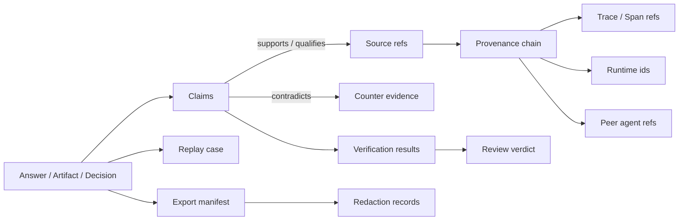

# 证据模型

Agent Evidence 是 graph，不是扁平 report。一个 pack 包含 claims、sources、activities、agents、artifacts、verification checks、review verdicts、redaction records、export records 与 replay boundaries。

## 图结构

## 关系类型

| Edge | 含义 |
| --- | --- |
| `supports` | Source 或 fact 直接支撑 claim。 |
| `partially_supports` | Source 只支撑部分 claim，或需要限定条件。 |
| `contradicts` | Source 与 claim 冲突。 |
| `qualifies` | Source 限定 claim 的适用范围。 |
| `background` | Source 是有用上下文，但不是直接支撑。 |
| `generated_by` | Entity 由某个 activity 产生。 |
| `used` | Activity 使用了 source、artifact、prompt、model、tool、policy 或 human decision。 |
| `derived_from` | Entity 从另一个 entity 转换而来。 |
| `attributed_to` | Entity 归因于 agent、user、system、organization 或 peer。 |
| `reviewed_by` | Claim、artifact 或 pack 被 review。 |
| `redacted_from` | Exported item 从敏感原文转换而来。 |

## Evidence 与 citations

Citations 是展示层。Evidence records 是展示背后的结构化事实。Citation 可以指向一个 source；claim map 可以解释 source selection、contradiction、confidence、omission、verification、review state，以及引用材料是否被 redacted 或 expired。

## Evidence 与 telemetry

Telemetry 解释系统运行行为：spans、events、logs、metrics、latency、errors 与 resource usage。Evidence 解释信任：Agent 断言了什么、为什么被支撑、什么反驳了它、谁评审了它、哪些内容可以回放。Agent Evidence 关联 telemetry ids，但不把 trace 复制进 evidence graph。
