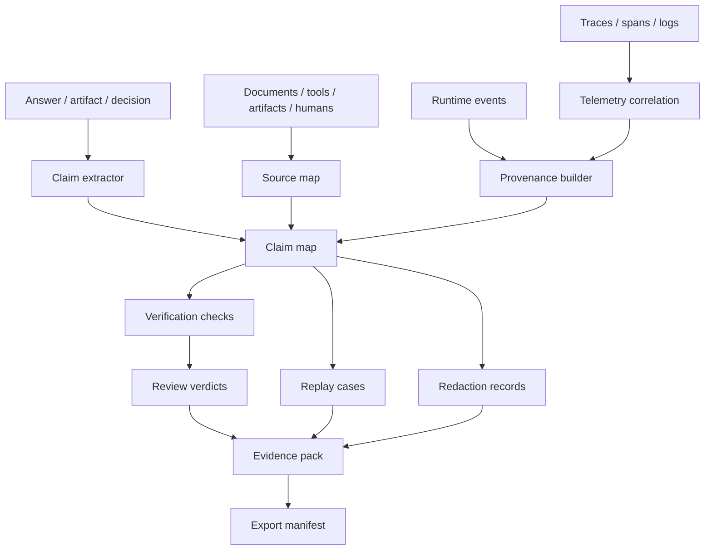

# 规范

Agent Evidence 最新草案是面向 Agent 工作证据记录的可移植标准。核心契约是 Agent outcome 与信任、回放、评审、脱敏、审计这些 outcome 所需证据之间的边界。

Agent Evidence 拥有 evidence relationships 与 read models。它不拥有 runtime execution、telemetry storage、source documents、artifact bytes、policy verdicts、legal conclusions 或 UI rendering。

## 范围

Agent Evidence 标准化以下实现问题：

1. Evidence pack 的 identity、scope、lifecycle 与 completeness status。
2. 将 assertions 连接到 sources、artifacts、tool results、telemetry refs 与 verification facts 的 claim maps。
3. 带 selectors、snippets、retrieval metadata、omissions、freshness、trust 与 contradiction records 的 source maps。
4. 连接 entities、activities、agents、models、tools、humans、artifacts、peer tasks 与 runs 的 provenance chains。
5. Verification results、review verdicts、rubrics、sign-off facts 与 open issues。
6. 描述哪些内容可重建、哪些 facts 缺失的 replay cases。
7. Redaction、retention、privacy、access 与 export-safety metadata。
8. 与 runtime ids、trace ids、span ids、events、logs、metrics 的 telemetry correlation。
9. 面向 audit、support、compliance、incident response 与 cross-system handoff 的 export manifests。
10. Runtime profile tests，证明 evidence、replay、review 与 export 消费同一组 Agent Runtime facts，且不创建第二条 execution timeline。

Agent Evidence **不** 标准化 UI component model、model provider protocol、observability backend、artifact byte format、legal policy、vector store、tool registry 或 workflow language。

## 真实证据系统的压力

Agent Evidence 不是更好看的 citation format。真实 Agent 系统反复出现这些要求：

1. Final answers 混合 facts、recommendations 与 generated fields；每一类都需要独立 support state。
2. Source 可能支撑一个 claim、反驳另一个 claim，并作为第三个 claim 的 background context。
3. Retrieval systems 会 omit、deduplicate、filter 或 reject sources；reviewer 需要知道原因。
4. Tool results 与 artifacts 会长期影响 claims，即使 raw output 已被截断或 redacted。
5. Runtime traces 对 debugging 必要，但不足以 review，因为它们不分类 claim support。
6. Review 与 verification 必须独立记录；passing check 不等于 approval。
7. Replay 往往只能 approximate，因为 model output、APIs、indexes、policies 与 permissions 会变化。
8. Privacy redaction 必须保留 audit shape，而不是静默删除不方便的事实。
9. Evidence 必须跨 UI 改版、backend migration、support export 与 peer-agent handoff 存活。

## 参考架构

兼容实现可以把这些步骤放在一个进程中，也可以拆到多个服务里。契约是可移植 evidence model，不是部署拓扑。

## 核心对象

| Object | 目的 |
| --- | --- |
| `evidence_pack` | 一个 session、task、run、artifact、answer 或 review scope 的 evidence graph 可移植容器。 |
| `claim` | 可能需要支撑的 assertion、decision、recommendation、generated field 或 artifact section。 |
| `source_ref` | 指向 document、knowledge item、retrieval result、tool output、artifact、trace、human input、policy、peer record 或 external record 的引用。 |
| `support_edge` | claim 与 supporting、contradicting、qualifying 或 background evidence 之间的关系。 |
| `provenance_node` | outcome 生产过程中的 entity、activity 或 agent-like participant。 |
| `verification_result` | 带 status、coverage、severity 与 evidence links 的检查结果。 |
| `review_verdict` | human、automated 或 policy review decision。 |
| `replay_case` | 重建 run 或 outcome 的 instructions 与 boundaries。 |
| `redaction_record` | 哪些内容被隐藏、转换、tokenized 或 withheld，以及原因。 |
| `export_manifest` | 描述 files、schemas、hashes、access 与 completeness 的可移植 manifest。 |

## 身份模型

| Identity | 含义 |
| --- | --- |
| `evidence_pack_id` | evidence pack 的 stable id。 |
| `scope_id` | session、thread、turn、task、run、artifact、answer、dataset row、review、incident 或 external case id。 |
| `claim_id` | claim 或 generated assertion 的 stable id。 |
| `source_id` | source reference 的 stable id。 |
| `edge_id` | support、contradiction、provenance 或 review edge 的 stable id。 |
| `verification_id` | verification result 的 stable id。 |
| `review_id` | review verdict 的 stable id。 |
| `replay_id` | replay case 的 stable id。 |
| `redaction_id` | redaction record 的 stable id。 |
| `export_id` | export manifest 的 stable id。 |
| `trace_id` / `span_id` | 可用时的 telemetry correlation ids。 |

兼容实现 MUST NOT 依赖单一 message id 表示所有 evidence。Claims、sources、artifacts、tool calls、reviews、replay cases 与 exports 都需要各自稳定的 ids。

## Evidence pack envelope

每个 evidence pack SHOULD 包含：

| Field | 要求 |
| --- | --- |
| `evidence_pack_id` | Required stable pack id。 |
| `schema_version` | Required Agent Evidence schema version。 |
| `scope` | Required scope object，至少包含一个 owner 或 external id。 |
| `status` | Required lifecycle status。 |
| `created_at`, `updated_at` | Required timestamps。 |
| `producer` | Required runtime、service、worker 或 host，表示组装 pack 的主体。 |
| `claims`, `sources`, `support_edges` | Inline compact facts 或 claim/source maps 的 refs。 |
| `provenance` | Production graph 或 ref。 |
| `verification_results`, `reviews` | Check 与 verdict facts。 |
| `replay_cases` | 可用时的 reconstruction instructions。 |
| `redactions` | Redaction summary 与 records。 |
| `telemetry` | Runtime 与 observability correlation refs。 |
| `completeness` | 按 category 记录的 completeness state。 |
| `refs` | External payload refs、schemas、artifacts、traces 或 export locations。 |

大型 payload SHOULD 以引用方式保存，不要复制。适合离线 inspection 的小型事实可以 inline。

## 生命周期

Evidence packs SHOULD 支持这些 states：

| Status | 含义 |
| --- | --- |
| `draft` | Evidence graph 正在组装。 |
| `collecting` | Runtime、telemetry、source、artifact 或 review facts 仍在到达。 |
| `ready` | Pack 已足够用于常规 inspection。 |
| `partial` | Pack 可用，但已知 facts 缺失。 |
| `verified` | Required checks 通过，或明确标记为 not applicable。 |
| `reviewed` | Human、automated 或 policy review 产生 verdict。 |
| `exported` | 已生成 export manifest。 |
| `redacted` | Sensitive content 已转换或 withheld。 |
| `expired` | Retention policy 移除了 required refs 或 payloads。 |
| `invalid` | Pack malformed，或与 authoritative facts 冲突。 |

## Event envelope

Evidence events MAY 通过 CloudEvents-like envelopes、runtime event streams、logs、queues 或 domain APIs 传输。每个 exported event SHOULD 包含：

| Field | 要求 |
| --- | --- |
| `type` | Required event class。 |
| `event_id` | Required unique event id。 |
| `timestamp` | Required producer timestamp。 |
| `schema_version` | Agent Evidence event schema version。 |
| `evidence_pack_id` | event 属于某个 pack 时提供。 |
| `claim_id`, `source_id`, `verification_id`, `review_id`, `replay_id`, `export_id` | 适用时提供。 |
| `trace_id`, `span_id` | telemetry 可用时提供。 |
| `subject` | 可选 scoped subject，例如 answer、task、artifact 或 review。 |
| `payload` | Typed event payload 或 ref。 |

## Event classes

兼容实现 SHOULD emit 或 export 这些 event classes：

- `evidence.pack.created`
- `evidence.pack.updated`
- `evidence.claim.added`
- `evidence.source.linked`
- `evidence.support.updated`
- `evidence.provenance.linked`
- `evidence.verification.completed`
- `evidence.review.completed`
- `evidence.replay.created`
- `evidence.redaction.applied`
- `evidence.export.created`
- `evidence.warning`
- `evidence.error`

## Completeness model

Pack SHOULD 按 category 声明 completeness，而不是只给一个 boolean：

| Category | 示例 |
| --- | --- |
| `runtime` | session、thread、turn、task、run、tool ids。 |
| `telemetry` | trace ids、spans、logs、metrics。 |
| `sources` | selected、omitted、missing、stale、contradicted sources。 |
| `claims` | supported、unsupported、contradicted、unreviewed claims。 |
| `artifacts` | artifact refs、versions、diffs、exports。 |
| `verification` | checks passed、failed、skipped、not applicable。 |
| `privacy` | redactions、retention、access、export controls。 |
| `replay` | deterministic inputs、unavailable systems、non-replayable steps。 |

Missing facts MUST 表示为 `unknown`、`unavailable`、`redacted`、`expired`、`not_applicable` 或 `not_collected`，不能被推断为 success。

## Validation

Validator SHOULD 检查行为与关系：

- every claim has a status and support classification。
- source refs identify owner, location, selectors, and retrieval or selection context where applicable。
- support edges use explicit relationships such as `supports`, `contradicts`, `qualifies`, or `background`。
- provenance links identify produced-by, used, derived-from, associated-with, or attributed-to relations。
- verification and review facts do not overwrite each other。
- telemetry ids are references, not a replacement for evidence semantics。
- redacted packs remain structurally valid and disclose redaction categories。
- replay cases declare what cannot be replayed。
- export manifests include schema version, file list, hashes, and completeness status。

## Compatibility levels

| Level | 要求 |
| --- | --- |
| `reference-only` | 实现可以链接外部 evidence pack，但不验证。 |
| `read` | 实现可以读取 pack identity、claims、sources、support edges 与 completeness。 |
| `write` | 实现可以生成 valid packs 与 update events。 |
| `review` | 实现可以附加 verification results 与 review verdicts，且不破坏 existing facts。 |
| `export` | 实现可以生成带 hashes、schemas、redactions 与 completeness 的 manifests。 |
| `replay` | 实现可以生成 replay cases 与 missing-fact records。 |
